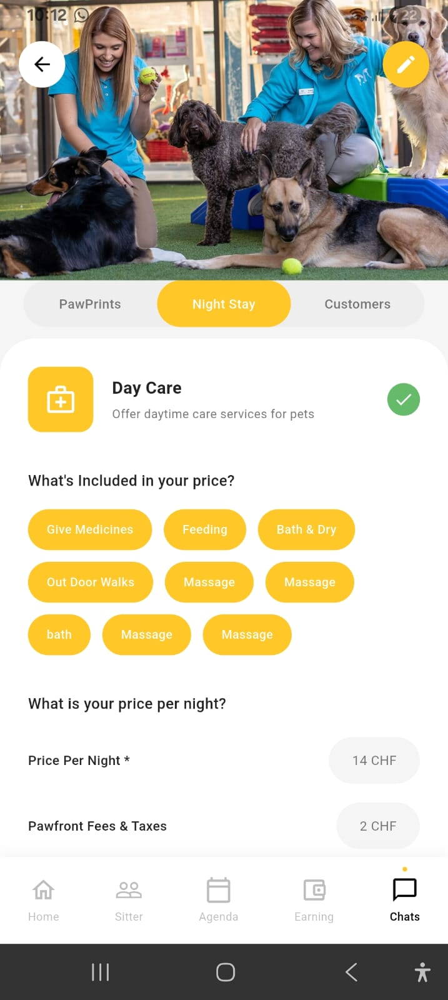

# Pet Care Service App

A Flutter application for pet care services featuring day care, night stay, and customer management.

## Screenshots

<p align="center">
  
</p>

## Features

- Day Care service management
- Service pricing calculator
- Multiple service offerings
- Clean and modern UI design

## Getting Started

### Prerequisites

- Flutter SDK (3.0.0 or higher)
- Dart SDK
- Android Studio / VS Code with Flutter extensions

### Installation

1. Clone the repository
```bash
git clone <repository-url>
cd pet
```

2. Install dependencies
```bash
flutter pub get
```

3. Run the app
```bash
flutter run
```

## Project Structure

```
lib/
  ├── main.dart
  ├── screens/
  │   └── day_care_screen.dart
  └── widgets/
      ├── bottom_nav_bar.dart
      ├── price_row.dart
      └── service_tag.dart
```

## UI Components

- Custom bottom navigation bar
- Service tag pills
- Price breakdown rows
- Tab navigation
- Responsive layout

## Design Details

- **Color Scheme**: Yellow accent (#FFC727) with white background
- **Typography**: Clean and readable text hierarchy
- **Components**: Reusable widgets for maintainability
- **Layout**: Responsive design with proper spacing

## Code Quality

- Clean and maintainable code structure
- Separated concerns with custom widgets
- No code duplication
- Proper state management
- Flutter best practices followed
